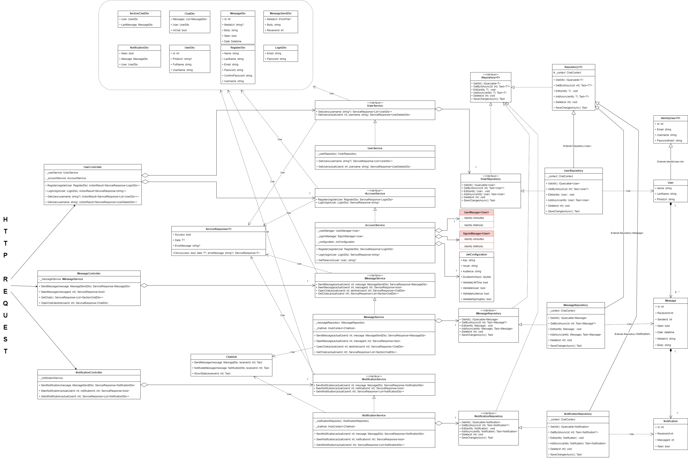

# Real-Time Chat with SignalR (pausado)

Este es un proyecto personal desarrollado para explorar y probar la tecnología SignalR con .NET. Implementa un chat en tiempo real siguiendo principios de Clean Architecture.
### 📜 Características

- Chat en tiempo real con SignalR.
- Backend desarrollado en .NET.
- Frontend construido con Angular.
- Extensible y fácil de mantener.

### Diagrama de clases del Back-end

